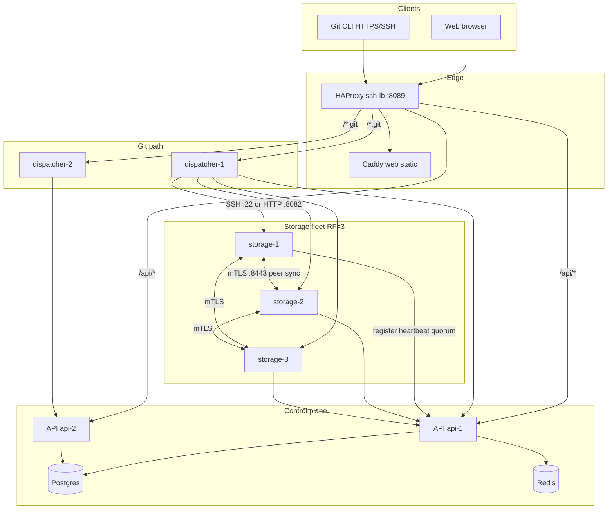
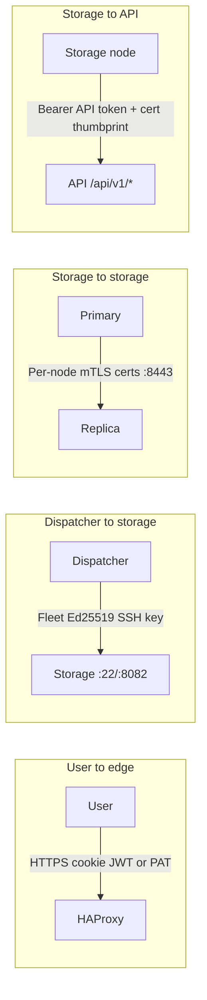
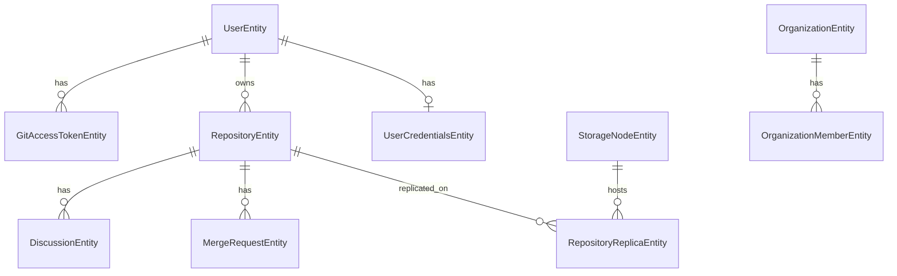

# OpenGitBase — Current State Overview

**Purpose:** Baseline for planning encryption improvements and distributed-system evolution.  
**Audience:** Agents and engineers entering the codebase cold.  
**Last updated:** 2026-07-10

For local setup and ports, see [README.md](../README.md). For feature-level design specs, see [prd/](prd/).

---

## 1. What This Project Is

OpenGitBase is a **self-hosted Git forge** (GitHub-like) in active development. It provides:

- Web UI for browsing repos, discussions, and merge requests
- Git over HTTPS (PAT) and optional SSH
- **RF=3 high-availability storage** (primary + 2 replicas, 2/3 write quorum)
- Organizations, repo membership, branch protection, push rules
- Admin fleet management for storage nodes

The project started from an **agentGenCli** .NET scaffold but has grown well beyond it: Nuxt web app, git dispatchers, and a 3-node storage fleet are all first-class components.

---

## 2. Runtime Topology

**Unified local entry:** `http://localhost:8089` ([docker-compose.yml](../docker-compose.yml))

| Component | Path | Role |
|-----------|------|------|
| API | [applications/OpenGitBase.Api/](../applications/OpenGitBase.Api/) | Control plane: auth, metadata, replication orchestration, content reads |
| Dispatcher | [applications/OpenGitBase.Dispatcher/](../applications/OpenGitBase.Dispatcher/) | Git Smart HTTP / SSH proxy; asks API for access + routing |
| Storage node | [applications/repo-storage-layer/](../applications/repo-storage-layer/) | Bare git repos, hooks, internal HTTP API, peer mTLS sync |
| Web UI | [applications/opengitbase-web/](../applications/opengitbase-web/) | Nuxt 4 SPA (cookie auth, hand-written API client) |
| Shared .NET | [common/](../common/) | CQRS, EF Core, auth, encryption, DbContext |
| Features | [features/](../features/) | Vertical slices (Users, Repository, StorageNode, MergeRequest, etc.) |

---

## 3. What Is Implemented

### 3.1 Identity, auth, and access

| Area | Status | Key files |
|------|--------|-----------|
| User registration, login, email verify, password reset | Done | [features/users/](../features/users/), [Controllers/Authorization/](../applications/OpenGitBase.Api/Controllers/Authorization/) |
| OAuth (Google, Apple) | Done | [SignInController.cs](../applications/OpenGitBase.Api/Controllers/Authorization/SignInController.cs) |
| JWT in httpOnly cookies + Bearer | Done | [Startup.cs](../applications/OpenGitBase.Api/Startup.cs), [AuthCookieService.cs](../applications/OpenGitBase.Api/Services/AuthCookieService.cs) |
| Admin role (`role=admin` claim) | Done | Admin controllers |
| Personal access tokens (HTTPS git) | Done | [features/git-access-token/](../features/git-access-token/) |
| SSH public keys (git over SSH) | Done | [features/public-git-ssh-key/](../features/public-git-ssh-key/) |
| Repository-level authz (private repos) | Done | [RepositoryContentAuthorizationService.cs](../applications/OpenGitBase.Api/Services/RepositoryContentAuthorizationService.cs) |
| Org membership + invites | Done | [features/organization/](../features/organization/) |

### 3.2 Repositories and collaboration

| Area | Status | Notes |
|------|--------|-------|
| Repo CRUD with RF=3 provisioning | Done | Requires ≥3 healthy storage nodes |
| Repo members, settings, default branch | Done | |
| Protected branches + push rules | Done | Enforced at storage `pre-receive` hook |
| Web browsing (tree, blob, README, refs) | Done | Reads from storage via API; replica routing |
| Discussions (threaded, anchors, sub-threads) | Done | [features/discussion/](../features/discussion/) |
| Merge requests (backend) | Done | Full lifecycle API; E2E tested |
| Merge requests (frontend) | Partial | List/create/detail/review UI done; **approve/merge/publish/close not wired in UI client** |
| Commit change view | In progress | Backend + page exist; remediation issues open |
| Notifications | Done | In-app |

### 3.3 Distributed storage and replication

| Area | Status | Notes |
|------|--------|-------|
| 3-node storage fleet in compose | Done | `storage-1/2/3` in [docker-compose.yml](../docker-compose.yml) |
| Node enrollment + heartbeat | Done | Cert thumbprint + API token |
| Fleet dispatcher SSH key (Ed25519) | Done | Encrypted private key in DB; bootstrap token for dispatchers |
| Per-node PKI (mTLS) | Done | [docker/pki/](../docker/pki/) |
| RF=3 repo create (provision all 3) | Done | [CreateRepositoryWithStorageQueryHandler.cs](../applications/OpenGitBase.Api/Services/CreateRepositoryWithStorageQueryHandler.cs) |
| Write quorum 2/3 on push | Done | `post-receive` → API `quorum-replicate` |
| Peer sync over mTLS :8443 | Done | Separate from dispatcher SSH trust domain |
| Watermark-based durability | Done | Monotonic `PrimaryWatermark` + per-replica `AppliedWatermark` |
| Primary failover + epoch promotion | Done | [PromotePrimaryReplicaQueryHandler.cs](../applications/OpenGitBase.Api/Services/PromotePrimaryReplicaQueryHandler.cs) |
| Background: RF1→RF3 backfill, rebalance, anti-entropy | Done | [HaStorageBackgroundService.cs](../applications/OpenGitBase.Api/Services/HaStorageBackgroundService.cs) |
| Admin replication dashboard | Done | Web + API |
| Git HTTPS via HAProxy | Done | [git-https-personal-access-tokens.md](prd/git-https-personal-access-tokens.md) |
| Optional SSH git (`--profile ssh`) | Done | Port 2211 via HAProxy |

### 3.4 Testing and ops

- **1050+** backend tests, **66** frontend unit tests
- E2E regression framework + merge-request E2E script
- Rolling update: [scripts/rolling-update.sh](../scripts/rolling-update.sh)
- Fleet bootstrap: [scripts/bootstrap-fleet.sh](../scripts/bootstrap-fleet.sh)

---

## 4. How Components Interact

### 4.1 Trust domains (critical for encryption planning)

OpenGitBase uses **four separate trust paths** — do not conflate them:

| Path | Auth mechanism | Used for |
|------|----------------|----------|
| Browser → API | JWT httpOnly cookie (or Bearer) | Web UI, REST |
| Git client → Dispatcher → Storage | PAT or SSH fingerprint lookup; fleet SSH to storage | clone, fetch, push |
| Storage ↔ Storage | mTLS (node.crt + CA) on :8443 | Quorum replication, `sync-from` |
| Storage → API | Bearer token + `X-Storage-Node-Certificate-Thumbprint` | Register, heartbeat, quorum-replicate, push-validation |

### 4.2 Repository creation (RF=3)

1. User calls `POST /repository` (authenticated).
2. API selects top 3 healthy nodes by free disk ([ReplicaSetPlanner.cs](../applications/OpenGitBase.Api/Services/ReplicaSetPlanner.cs)).
3. API calls each node `POST :8081/internal/repos` via [StorageProvisionerClient.cs](../applications/OpenGitBase.Api/Services/StorageProvisionerClient.cs).
4. DB writes `RepositoryEntity` + 3 `RepositoryReplicaEntity` rows (`ReplicationState=Rf3Healthy`, `PrimaryWatermark=0`).

### 4.3 Git push with quorum

1. Client pushes via dispatcher (HTTPS or SSH).
2. Dispatcher calls API access-check → routes **writes to primary** only.
3. Storage runs `pre-receive` → API push-validation (protected branches, push rules).
4. Refs applied on primary; `post-receive` runs [storage-quorum-replicate.sh](../applications/repo-storage-layer/scripts/storage-quorum-replicate.sh).
5. Primary bumps local watermark, calls `POST /api/v1/storage-nodes/repositories/{id}/quorum-replicate`.
6. API orchestrates peer `sync-from` (mTLS fetch) until **2 of 3** nodes durable → commits watermark in DB.
7. Third replica catches up asynchronously.

### 4.4 Web content read

1. Browser calls `/api/repository/by-slug/{owner}/{slug}/content/...`.
2. API authorizes (public or member), picks read replica via [WebReadReplicaSelector.cs](../applications/OpenGitBase.Api/Services/WebReadReplicaSelector.cs).
3. API reads from storage internal HTTP (`StorageContentClient`) — not from dispatcher.
4. UI shows sync banner if replica lags primary watermark.

### 4.5 Fleet bootstrap (first run)

1. Start Postgres + API + HAProxy.
2. [bootstrap-fleet.sh](../scripts/bootstrap-fleet.sh): generate PKI, admin login, create dispatcher SSH keys, create per-node enrollment tokens.
3. Patch `docker-compose.override.yml` with secrets (not committed).
4. Start storage nodes → auto-register; dispatchers fetch encrypted private key via bootstrap token.
5. Storage nodes install dispatcher public key in `authorized_keys`.

---

## 5. Data Model (simplified)

**Replication fields on `RepositoryEntity`:** `PrimaryStorageNodeId`, `ReplicationEpoch`, `PrimaryWatermark`, `ReplicationState` (Rf1Backfilling | Rf3Healthy | Degraded | Promoting).

DbContext: [OpenGitBaseDbContext.cs](../common/OpenGitBase.Common/Data/OpenGitBaseDbContext.cs)

---

## 6. Current Encryption and Secrets Posture

### 6.1 What is encrypted today

| Data | Mechanism | Implementation |
|------|-----------|----------------|
| User emails | AES-256-GCM + HMAC lookup hash | [EmailProtectionService.cs](../common/OpenGitBase.Common/Services/EmailProtectionService.cs) → `UserCredentialsEntity.EmailCiphertext` |
| Storage node API tokens | Same AES-GCM (`EncryptSecret`) | `StorageNodeEntity.ApiTokenProtected` |
| Fleet dispatcher SSH private key | Same AES-GCM | `FleetSecretsEntity.DispatcherSshPrivateKeyProtected` |
| Passwords, PATs, invite/enrollment tokens | ASP.NET `PasswordHasher` + SHA256 lookup hashes | Various handlers |
| JWT signing | HMAC-SHA512 symmetric key | `Jwt:Key` in config |
| Transport: storage peer sync | mTLS (per-node X.509) | nginx :8443, [docker/pki/](../docker/pki/) |
| Transport: user-facing | TLS at edge (deployment-dependent) | HAProxy/Caddy; local dev often HTTP |

**Config:** `Encryption:DataKey` (32-byte base64) + `Encryption:Pepper` in [appsettings.json](../applications/OpenGitBase.Api/appsettings.json).

### 6.2 What is NOT encrypted

- **Git repository contents at rest** — plain bare repos on storage node disk (`/srv/git/{repositoryId}.git`)
- **Postgres row data** beyond the fields above (repo metadata, discussions, MRs, etc. are plaintext in DB)
- **Redis cache** (if used for content cache) — plaintext
- **Dispatcher ↔ storage git traffic** on :8082/:22 — not mTLS (relies on private network + SSH key or network isolation)
- **API ↔ storage internal HTTP :8081** — Bearer token only, no mTLS

### 6.3 Network access controls (partial)

- [InternalNetworkMiddleware.cs](../applications/OpenGitBase.Api/Middleware/InternalNetworkMiddleware.cs): optional IP allowlist (RFC1918/loopback) for `/api/v1/storage-nodes/*`, fleet bootstrap, push-validation
- Storage `sshd_config`: denies git SSH from non-private IPs
- **Known gap:** IP allowlists break behind reverse proxies; mTLS on fleet endpoints is planned but not done ([sec-02](issues/code-review-remediation/02-internal-network-trust.md))

---

## 7. Known Gaps and Planned Hardening

From [code-review-remediation/](issues/code-review-remediation/README.md):

| ID | Topic | Relevance to encryption/distributed |
|----|-------|-------------------------------------|
| sec-02 | Internal network trust → mTLS/service tokens on fleet endpoints | **High** — replaces IP-only trust for storage↔API |
| sec-04 | Storage push hardening (Smart HTTP :8082 not anonymously reachable) | **High** — aligns with sec-02 trust model |
| sec-05 | Production secret validation (reject dev JWT/encryption placeholders) | **High** — encryption key management |
| sec-03 | Repository access DTO redaction | Medium — info disclosure |
| sec-01 | MSW lockdown in production builds | Low for backend crypto |

**Frontend gaps:** MR lifecycle actions (approve/merge/publish/close) exist in API but not in [api.ts](../applications/opengitbase-web/app/utils/api.ts) / detail page.

**Architecture decisions** live in [prd/](prd/) and [issues/](issues/) slices — there is no `docs/adr/` yet.

---

## 8. Feature Module Index

| Module | DB | Public API | Notes |
|--------|-----|------------|-------|
| Users | yes | auth routes | Email encrypted |
| Repository | yes | yes | HA provisioning |
| RepositoryMember | yes | yes | |
| Organization | yes | yes | Invites |
| StorageNode | yes | `/api/v1/*` internal | Fleet registry |
| GitAccessToken | yes | yes | PATs |
| PublicGitSshKey | yes | yes | |
| Discussion | yes | yes | Full threading |
| MergeRequest | yes | yes | Server-side merge |

Registration: [FeatureRegistration.cs](../applications/OpenGitBase.Api/FeatureRegistration.cs)

---

## 9. Key Docs for Deeper Dives

| Document | Topic |
|----------|-------|
| [ha-storage-replication.md](prd/ha-storage-replication.md) | RF=3 design, watermarks, failover |
| [git-storage-proxy.md](prd/git-storage-proxy.md) | Dispatcher architecture |
| [git-https-personal-access-tokens.md](prd/git-https-personal-access-tokens.md) | HTTPS git auth |
| [merge-requests.md](prd/merge-requests.md) | MR lifecycle design |
| [repository-web-browsing.md](prd/repository-web-browsing.md) | Content reads, replica routing |
| [ha-storage-replication/README.md](issues/ha-storage-replication/README.md) | HA implementation slices |
| [AGENTS.md](../AGENTS.md) | Agent onboarding |

---

## 10. Suggested Discussion Framing for Next Work

When planning **encryption** improvements, the natural layers are:

1. **Secrets management** — `Encryption:DataKey` rotation, production validation (sec-05), KMS integration
2. **Fleet endpoint auth** — mTLS storage↔API, dispatcher↔storage (sec-02, sec-04)
3. **Data at rest** — repo content encryption (not started), Postgres TDE or field-level encryption for sensitive metadata
4. **Transport** — enforce TLS everywhere in production compose profiles

When planning **distributed system** improvements, build on what exists:

1. **Control plane is centralized** (Postgres + API) — storage nodes are stateful workers
2. **Quorum replication is push-synchronous** — async third replica; watermark is the durability contract
3. **Failover uses epochs** — split-brain protection already modeled
4. **Background reconcilers** handle drift, RF1 migration, rebalance — extension points for new policies

The system is past prototype: HA storage, git proxy, web forge features, and extensive tests are in place. The main security evolution path is **strengthening inter-service trust** (mTLS beyond storage peers) and **deciding whether/how to encrypt git objects at rest**.
